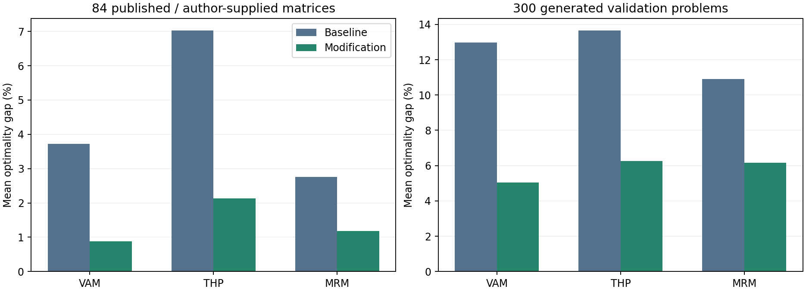

# Transportation problem research: reproducible baselines and small modifications

Research date: 1 October 2026. This is an experimentally supported research report with explicit unresolved sources, not a claim that every requested acronym or published result has been verified. **A** = supplied paper; **B** = external literature; **C** = our implementation, experiment or interpretation.

For the complete Indonesian synthesis and practical conclusions, start with [hasil_riset_dan_kesimpulan.md](hasil_riset_dan_kesimpulan.md). IHW is skipped at the user's request. The JHM follow-up below adds restricted implementations and experiments without claiming the inaccessible full method was recovered.

## 1. Executive summary

The most practical current directions are **VAM with two-candidate heuristic completion**, **THP with the same completion idea applied after its published candidate filter**, and, as a lighter but more conditional alternative, **MRM with a best-of-orientations construction**. These are adaptations/combinations of known ideas; novelty is not established. THP offers the clearest manually explainable starting example in the user's supplied papers. VAM has the strongest mean-gap performance among these three tested modifications. MRM requires less additional computation but its orientation modification did not improve its own 13 small benchmark examples.

The work goes beyond literature review: five supplied PDFs were inventoried first; 140 source occurrences were transcribed into 86 distinct raw problems, or **84 after balancing-equivalent duplicates are removed**. Fourteen explicitly named baseline configurations and 24 small variations were run. A further **300 fixed random problems** cover 3x3, 4x4, 5x5, 6x6 and 10x10 matrices under three cost distributions. Every problem was solved independently by a transportation LP, with primal feasibility and dual certificate checks. Numerical results, failures, ties, allocations and traces are saved.

| Confirmed experiment | Baseline cost | Modified cost | LP optimum | Baseline gap % | Modified gap % | Improvement |
|---|---|---|---|---|---|---|
| Supplied THP paper, Example 1: THP -> top-2 THP completion | 1045 | 985 | 985 | 6.0914 | 0 | 60 |
| Same Example 1: VAM -> top-2 VAM completion | 1095 | 985 | 985 | 11.1675 | 0 | 110 |
| Supplied THP paper, Example 2: VAM -> top-2 VAM completion | 5125 | 4525 | 4525 | 13.2597 | 0 | 600 |
| Supplied BCE paper, Table 2: VAM -> top-2 VAM completion | 475 | 435 | 435 | 9.1954 | 0 | 40 |
| Hosseini Example 1: our MRM run -> orientation ensemble | 3710 | 3460 | 3460 | 7.2254 | 0 | 250 |

The first four baseline costs match the respective supplied paper claims. The final row is a **new cross-paper experiment**: Hosseini supplies the matrix; its 2017 paper does not report the later 2025 MRM cost. No published MRM result is invented for that row.

The JHM follow-up adds **1,930 runs** of a restricted baseline and four variants, plus a separate 430-run audit of ten further source occurrences (six exact core duplicates). These include the supplied BCE paper's complete 2x94 real application, found during a second inventory pass. Core 84-case comparisons remain frozen. JHM receiver capping improves the supplied 460 example to optimum 435, but worsens 20 of 73 paired random cases; it is not a consistently better rule.

Important limits remain: IHW is unidentified and **skipped by user instruction**; JHM's full original multi-excess algorithm was not accessible; BCE's balanced implementation is a qualified interpretation with failures; CSM and RBSM have paper/code ambiguities; several author datasets contain conflicting labels or numbers. These methods are not all equally validated. The supporting [progress record](../progress.md) distinguishes completed experiments from outstanding source work.

## 2. Research objective

Identify a specific decision weakness, modify it simply, reproduce a credible baseline on published inputs, compare against the same inputs and independently verified optima, and test whether improvement survives broader experiments. A lower cost on one hand-picked case is insufficient. A clear adaptation with honest failure analysis is preferable to an unsupported claim of a universally optimal or novel method.

## 3. Transportation problem background

For the balanced, single-commodity linear-cost problem, minimize Z=sum_i sum_j C_ij X_ij, subject to sum_j X_ij=s_i, sum_i X_ij=d_j and X_ij>=0. The implementation assumes a complete nonnegative finite cost matrix. Integer margins admit an integer optimum because the transportation constraint matrix is totally unimodular; the solver still uses floating-point numerical LP and its residuals are checked.

If supply exceeds demand, a zero-cost dummy destination represents unused supply; if demand exceeds supply, a zero-cost dummy source represents unserved demand under the paper's convention. That is a modelling assumption, not a universal economic shortage price. Actual shortage penalties must be specified when applying the method to a real business.

A nondegenerate basic solution has m+n-1 positive basic cells. A degenerate basic solution can have fewer positive cells; zero basic cells complete a cycle-free basis. Counting positive cells alone is not a valid feasibility or optimality test.

## 4. IBFS, improvement methods and exact optimization

VAM, LCM, NWCM, RAM, THP, TDM and the identified repair heuristics generate a starting solution. Some begin with an infeasible allocation and repair it before returning a feasible result. Being called an approximation or directly attaining the optimum on examples does not change that role.

MODI/transportation simplex/stepping-stone improvement operates on an existing feasible basis, using opportunity costs and cycle adjustments. LP directly solves the full optimization model. This report compares **initial costs** against LP ground truth; it does not claim the best initial cost always produces the fewest subsequent pivots or the fastest complete optimizer. The 2022 SSM is Supply Selection Method; SSM in some other papers means Stepping Stone Method.

## 5. Literature search methodology

The local inventory preceded external research. Searches then used exact titles and DOIs, acronym+transportation queries, author names, cited foundational works, later modifications, and explicit novelty queries for tie rules, allocation weighting, top-k selection, range methods, look-ahead and rollout. Primary publisher records, original full papers and author supplements were preferred. Indonesian searches helped locate JHM applications. Unrelated vehicle routing, infectious healthcare waste and Independent Hypothesis Weighting results were excluded from method identification.

See [search log](search_log.md) and [source inventory](source_inventory.md) for access levels. Search dates do not guarantee exhaustive coverage through that date. Inaccessible originals and subscription-only comparison studies limit novelty conclusions. No fabricated DOI or invented algorithm fills a gap.

## 6. Source inventory and terminology

The full requested acronym table, deterministic choices, balance handling and algorithm contracts are in [terminology_and_algorithms.md](terminology_and_algorithms.md). The [supplied-paper inventory](../paper_inventory.md) records title, authors, year, DOI, method, numerical examples and reported results. The [external inventory](source_inventory.md) classifies foundational, modification, comparative, review/background, benchmark, reference-optimum and inspiration sources.

The DOI labelled "IBFS-related method" defines **BCE**, so these two user entries are one method. TDM must distinguish TDM1/TDM2. The chosen MRM is Wireko's 2025 cost version, and the chosen CSM is the verified 2026 Cost Supply Method; the empty local folders cannot independently confirm these were the user's intended versions. TDSM is evaluated at theta=2, while Hosseini's published formula allows 1<theta<=2. IHW remains unresolved.

## 7. VAM analysis

The supplied THP paper describes classical VAM as maximum line regret, where regret is second minimum minus minimum; arbitrary line/cell ties are completed deterministically in our baseline. This reproduces its VAM costs 1095,5125,2388. The cheapest route in the highest-regret line can still consume capacity needed elsewhere. The weakness is the **cell commitment after penalty ranking**, not the fact that VAM is "approximate" in general.

An allocation tie, cost tie, P*A, P*sqrt(A), top-2 lower-bound estimate, top-2/top-3 completion, first-decision-only completion, and tie+completion combination were tested. Multiplication by feasible quantity was not reliably beneficial. The promising variant includes the original candidate and compares complete residual VAM costs; its added computations must be disclosed. Top-k and cost/opportunity modifications already have substantial prior art, including THP and [IVAM](https://doi.org/10.3390/mca16020370).

## 8. IHW analysis

No defensible TP definition or original source was found. The supplied IHW folder was empty. The acronym is not expanded, classified, implemented or ranked by guesswork. **The user requested that IHW be skipped on 1 October 2026.** No answer or permission is pending for this method.

## 9. SSM analysis

The supplied [2022 SSM paper](https://doi.org/10.1016/j.eswa.2022.117399) allocates column demand to least costs, then repairs excess rows using smallest absolute cost differences. Equal differences prefer larger allocated quantities. The donor/receiver satisfaction decision depends on original supply and the number of excess rows. Its worked 3x3 example reproduces 465 and LP confirms 465.

The exact vulnerability is the **supply-based transfer-priority branch**: original supply does not measure the present cost of displacing shipments. Choosing one target can overshoot the other row's residual. The complete 45-case performance claim, 41 optima, is preserved as a paper claim; its data link did not expose all matrices. Our cross-paper SSM results use the documented index completion for unresolved ties and are not a claim to reproduce all 45 cases.

## 10. Analysis of the IBFS DOI

[10.1016/j.jksuci.2020.07.007](https://doi.org/10.1016/j.jksuci.2020.07.007) is Amaliah, Fatichah and Suryani's BCE paper, published online in 2020 and in the 2022 journal issue. It is not a distinct unnamed IBFS algorithm. Its worked matrix, 35 source/result rows, claims and ambiguities are treated under BCE below. Duplicate naming must not double its evidence or apparent coverage.

## 11. MRM analysis

Wireko's [2025 MRM](https://doi.org/10.1016/j.rico.2025.100551) uses maximum cost ranges and freezes row/column orientation after its first decision. Dummy-source and dummy-destination cases force the respective orientation. Our narrative implementation reproduces **all 13 small reported MRM costs**, and all 13 corresponding printed optima agree with LP. The MATLAB listing and one worked elimination choice are not fully consistent with the narrative; those differences remain documented.

Our hypothesis targets the **permanent orientation commitment**. Returning the best of the default, row-forced and column-forced constructions reduces mean gap on cross-paper and random tests. However, it improves **none of the 13 original small cases**: the three nonoptimal source cases remain 248 versus 240, 415 versus 410, and 450 versus 430. This is a substantial limitation when choosing the main project. Earlier row/column range methods make its novelty risk high.

## 12. CSM analysis

The externally obtained [CSM paper](https://doi.org/10.48084/etasr.16468) uses row total TC and priority CS=s_i*TC_i in a demand-first repair scheme. Its worked 4x5 cost 1780 is reproduced and LP-confirmed. It reports 33/42 optima, but the data and result supplements reuse some labels for different matrices. We do not assert a reproduced 33/42 hit rate.

The targeted weaknesses are **static total-row cost multiplied by original supply** and the tie estimate q*C_receiver, which is a gross cost rather than the actual change q*(C_receiver-C_donor). The numbered algorithm and Figure 3 pseudocode also differ. These are useful research questions, but source reconciliation should precede a main CSM modification project.

## 13. RBSM analysis

The supplied [2026 RBSM](https://doi.org/10.1016/j.mex.2026.103825) changes SSM's priorities using unit-cost times original supply and row-total tie information. Its two printed numerical cases reproduce 111 and 7750. The paper reports 36/42 optima and mean gap 0.58%; those are source claims, not our cross-paper results.

The author dataset and C++ were recovered. Differences between that code and the numbered paper include transfer-cost accounting, retained candidate priority values, equality rules and the equal-supply branch. The code was inspected, not silently used as authority to overwrite the paper. RBSM's **gross tie-cost estimate and original-supply product** are plausible modification points, but uncertainty about the exact published computational implementation raises project risk.

## 14. JHM analysis

The [original 2015 publisher record](https://doi.org/10.1016/j.asoc.2015.05.009) confirms a column-first infeasible-start repair heuristic with a specific tie mechanism. Supply-surplus initial construction need not add a dummy destination; demand excess is balanced. The original full decision tree remains unavailable. Selected indexed pages of Indrawan et al. 2021, now verified as [DOI 10.20527/epsilon.v15i1.2876](https://doi.org/10.20527/epsilon.v15i1.2876), and a public 2024 thesis introduction support a **restricted single-excess contract**. Unknown multi-excess dependency and third-cost branches are explicitly excluded, not replaced by a generic heuristic.

The restricted baseline and four variations were implemented. It returns verified feasible/basic results for 55/84 core and 73/300 random inputs. The supplied L01 JHM cost 460 is reproduced; L03 yields 473 against the printed 475 under the higher-donor-cost tie. A separately labelled index-tie sensitivity run yields 475; it is not silently substituted to force agreement.

Receiver-capped transfer q=min(cell allocation, donor excess, receiver deficit) improves L01 from 460 to LP optimum 435. Across 55 paired core cases it improves/ties/worsens 15/28/12; across 73 paired random cases, 14/39/20, with mean gap worsening from 3.6944% to 6.4576%. Top-two completion improves paired core mean gap from 2.0929% to 1.0400%, and paired random mean from 3.3185% to 0.8971% on only 70 cases. Different coverage forbids a full-suite ranking. Cap+net-tie ablation adds no observed benefit over cap alone.

Nine JNM Appendix A matrices and BCE's printed 2x94 case were also extracted and LP-checked. Six of these ten source occurrences duplicate existing core matrices. Detailed access levels, algorithm, all exclusions, source reproduction mismatches, counterexample 5600 -> 6880, and a manual 460 -> 435 demonstration are in [jhm_analysis.md](jhm_analysis.md), [jhm_results.md](jhm_results.md), and [jhm_supplement.md](jhm_supplement.md). JHM remains a conditional research direction because the complete baseline is not yet verified and the simplest change lacks robustness.

## 15. TDSM analysis

Hosseini's formula sums powered deviations from each row minimum. Squaring gives extreme differences disproportionately large influence: replacing a deviation 2 by 4 changes its squared contribution from 4 to 16. This is an **outlier sensitivity mechanism**, not proof that squaring is always harmful. The theta=2 baseline was compared directly with TDM1 and TDM2 on every transcribed problem.

Theta=1.5 was tested as an existing published parameter choice, not proposed as novel. It improved 5 and worsened 8 of 84 published/author cases. Several original numerical costs cannot be recovered at theta=2, even after enumerating all valid arbitrary ties. The unspecified exponent used for every published result is a limitation. A capped or robust penalty remains an untested reserve idea, not an evidence-based recommendation.

## 16. TDM analysis

TDM1 selects the row with maximum sum of cost differences from its minimum; TDM2 considers both orientations. This uses more entries than VAM's two minima, but still ignores allocation sizes and future shared capacity. In rectangular TDM2 a raw sum also depends on line length. A mean deviation or two-row completion would target these exact decisions.

Original TDM1 Example 2 reports 630; the extracted rules with all allowed ties yield only 610 or 650. Examples 6 and 7 similarly fail to reach the reported values. Costs, margins, row elimination and tie possibilities were inspected; baselines were not altered to force agreement. The evidence supports an explicit qualified implementation, not a clean reproduced-paper claim across all seven cases.

## 17. BCE analysis

The supplied BCE worked example reproduces **435**, and the BCE comparison in the supplied SSM example reproduces **475**, versus LP 465. The method modifies JHM's transfer decision with supply/cost modulo and row-total comparisons. Its modulo branch exposes a particularly concrete weakness: changing currency scale can change the solution path even though the underlying optimization problem is equivalent.

On the fully reproduced L01 matrix, multiplying every cost by 10 changes the qualified BCE result from 435 to 460 in original cost units. This is documented in [currency_sensitivity.csv](../results/currency_sensitivity.csv). However, the current balanced interpretation also cycles on other cases; unbalanced BCE is deliberately unavailable. There are 15 failures/unimplemented cases among the 84 summary problems and 96 failures in 300 random cases. These are **implementation-contract failures**, not a proof that the original published BCE necessarily cycles. Its successful-only mean is not a fair ranking. Resolve least/next-least bookkeeping and original tie rules before making BCE the main project.

## 18. RAM analysis

RAM calculates active row maxima u and column maxima v, then chooses the smallest C_ij-u_i-v_j. These are heuristic opportunity proxies; they are not LP-optimal dual prices. A large outlier affects many proxy scores, and equal proxies need a selection rule. Maximum-allocation ties and top-two opportunity completion are simple potential modifications, currently untested here. RAM's 84-case mean gap is 2.374%, but a different larger benchmark distribution can change its ranking; see [Szwarc et al.](https://doi.org/10.17270/J.LOG.2019.346).

## 19. LCM analysis

LCM provides the simplest cost-based baseline. A lowest unit cost can consume the only useful supply for another destination. Maximum-allocation ties, top-two residual bounds, top-two/top-three completion and three normalized weights were tested. The maximum-allocation tie is already published, including in [iLCM](https://www.scienpress.com/download.asp?ID=1899).

Top-two completion improves 48/84 published cases and 174/300 random cases without worsening relative to the specified LCM baseline, yet its random mean gap remains 16.172%, worse than ordinary VAM's 12.968%. Improving a weak baseline is not sufficient to establish a competitive heuristic. LCM is an excellent coding/manual control and a reserve project candidate, but weaker than the selected directions under the tested quality criteria.

## 20. NWCM analysis

NWCM depends on row/column ordering, not transportation costs. It is deterministic for a fixed input order and useful for validating feasibility, balancing and degeneracy. Its mean published gap is 35.083%; this is expected context rather than evidence of a new weakness discovered here.

One-time cost-based ordering or a small permutation portfolio could preserve its corner-allocation simplicity. Selecting the globally cheapest cell at every step would effectively become LCM, so it should not be described as a new NWCM invention. No NWCM modification is promoted without experiments and an ordering-literature check.

## 21. Additional methods found

The [additional-method inventory](source_inventory.md#additional-relevant-transportation-heuristics-found-during-deep-research) covers THP, LDVAM, IVAM, TOCM/TOCM-MT, KSAM, ITDM, TDM+KSAM, JNM, iLCM, capacity/weighted-opportunity rules and range-method relatives. Their roles differ: reproducible baseline, candidate-filter inspiration, comparison control, or evidence against a novelty claim. They do not automatically expand the main project into implementing every literature method.

## 22. Cross-method comparison and feasibility

Quality below is the standardized mean gap on **84 deduplicated published/author matrices under the documented implementations**, not a universal method ranking. Detailed medians, maxima, standard deviations, hit rates and failures are in [performance_tables.md](performance_tables.md).

| Method | Core idea / mean gap % | Exact weakness / modifiable part | Tie handling | Benchmark and reproduction | Implementation / manual difficulty | Research opportunity |
|---|---|---|---|---|---|---|
| VAM | Two-minimum regret / 3.718 | Single candidate commitment; ties | Explicit index completion; alternatives tested | Three supplied VAM anchors match, wider literature | Low / low; completion moderate | Strong tested adaptation, crowded prior art |
| IHW | Unknown; skipped by user | Unknown | Unknown | No source | Not assessed | Excluded from current work |
| SSM | Supply-directed repair / 2.603 | Original supply/count branch | Allocation tie; residual index | Worked anchor matches; all 45 not reconstructed | Medium / medium | Good mechanism, tie/repair risk |
| IBFS/BCE | Modulo-directed repair / mean not comparable because failures | Dimensionally sensitive branch and successor bookkeeping | Incomplete original choices | Two local BCE anchor costs match; other cases fail | High to reproduce / high | Distinct weakness, currently high implementation risk |
| MRM | Frozen maximum-range orientation / 2.758 | Permanent first orientation | Minimum cost then northwest | 13/13 original small costs match | Low / low | Lightweight ensemble; no gain on own 13 cases |
| CSM | Row-cost total times supply / 2.275 | Static priority and gross transfer cost | Row total, gross cost, completed residual ties | Worked anchor matches; conflicting supplements | Medium-high / medium | Resolve paper/data contract first |
| RBSM | Cell-cost times supply / 2.539 | Supply product, tie-cost estimate | Row totals; completed residual ties | Two local anchors match; paper/code differ | Medium-high / medium | Source audit currently more urgent than another score |
| JHM | Column-first repair / subset means only | Overshoot and ties; multi-excess branch still unknown | Higher donor-cost tie; index diagnostic separate | Restricted baseline and four variants tested; 55/84 core coverage | Partial contract moderate / small example easy | Cap inconsistent; completion promising only within limited scope |
| TDSM | Squared row differences / 2.285 | Outlier amplification / exponent | Index completion | Seven matrices; several claims fail | Low / low for squares | Reserve; fractional exponent already exists |
| TDM1 / TDM2 | Summed deviations / 2.801 / 3.747 | Quantity blindness, line-length bias | Index completion | Seven original matrices, mixed reproduction | Low / low | Reserve; TDM2 already published |
| RAM | Maxima-based opportunity proxy / 2.374 | Proxy distortion and equal scores | Index completion | Classical sources, broad cross-paper inputs | Low-medium / low-medium | Useful strong comparator; modifications untested |
| LCM | Global cheapest cost / 9.263 | Greedy route consumption | Index baseline; allocation variant | Numerous matrices; some source costs depend on version | Very low / very low | Strong teaching baseline, weaker competitive results |
| NWCM | Fixed corner order / 35.083 | Cost blindness / ordering | Fixed order | Numerous matrices; deterministic audit control | Very low / very low | Limited standalone novelty |
| THP | Two range levels, minimum cost*allocation / 7.023 | Immediate product ignores residual costs | Minimum cost then index | All three supplied THP costs match | Low / low; completion moderate | Best supplied manual case; only one original improvement |

No arbitrary numeric feasibility score is assigned. Literature volume is substantial for VAM/LCM/RAM/NWCM, more specific for the newer repair family, and unresolved for IHW. Benchmark *availability* and trustworthy baseline reproduction are separate criteria.

## 23. Published numerical benchmarks

[benchmark_catalog.md](benchmark_catalog.md) gives every distinct raw cost matrix, supply, demand, shape, balance status, source aliases, published claims and LP optimum. [occurrences.json](../datasets/published/occurrences.json) preserves all 140 source occurrences, including duplicates. [exclusions.json](../datasets/published/exclusions.json) records missing/malformed inputs rather than filling them in.

Some RBSM author files already include zero dummy margins. An explicitly unbalanced matrix and its balanced equivalent are retained for provenance but count once in the summary. For MRM the input's known dummy status affects orientation; the original unbalanced representation is preferred when available. Otherwise an apparent improvement could arise merely from treating a dummy row as an ordinary supplied row.

The 84-case suite mixes literature instances and author synthetic/real datasets. The 300 separately generated instances are labelled separately. No missing original matrix is reconstructed by matching a reported optimum.

The later [JHM supplementary audit](jhm_supplement.md) contains ten source occurrences separately: nine E19 Appendix A matrices and L01's real 2x94 case. Six are exact core duplicates; four are new raw matrices, one with a source conflict retained for sensitivity only. These are not silently appended to the frozen 84-case averages. L01 real-case BCE/VAM/JHM costs 12175097 and TDM1 12208071 reproduce; LP confirms 12175097. The supplementary THP experiment gives 12714389 -> 12282430, still above optimum; MRM gives 12264685 -> 12175097.

## 24. Baseline reproduction results

There are 1,204 raw baseline runs (86x14). The 207 explicit claim comparisons comprise **177 matching, 23 nonmatching and 7 unavailable** comparisons, including repeated source optima and two audited worked allocations. These counts are an audit workload, not a method success rate. [reproduction_tables.md](reproduction_tables.md) shows every comparison and its status.

Reliable anchors include all three THP costs, all three VAM costs in L05, BCE's local worked case, SSM's local worked case, RBSM's two printed cases, CSM's worked case, and all 13 small MRM costs. Known failures include the following:

- AIP Example 1's printed optimum 61 is contradicted by its own feasible worked allocation costing 55; LP confirms **55**. Its NWCM values also disagree with the deterministic rule.
- AIP's LCM-labelled costs 55 and 1995 cannot be obtained by the extracted global-minimum LCM rule under any permitted cheapest-cell ties for those matrices. Reachable costs are 61, and 2310/2360 respectively.
- Hosseini TDM1 Example 2 reports 630; exhaustive valid ties yield 610 or 650. TDSM Example 5 at theta=2 yields 1465, not 1661. Further unresolved discrepancies are retained, not corrected in source data.
- CSM's N03 printed C55=1 differs from the RBSM author's corresponding C55=12; LP optima differ, so these are separate matrices. CSM N32's printed optimum 348 is wrong for the shown matrix (1780). S2 prints 2790 for a matrix whose LP optimum is 153500. S3 repeats S5's matrix but prints 1044180 instead of its actual 116020.
- CSM labels N06,N18,N28,N33,N35 do not consistently identify the same matrix in its data and results documents. N04 differs between CSM and RBSM. No label-only join is accepted.

Algorithm steps, ties, balance, degeneracy, arithmetic and available PDF images were checked. [tie_enumeration.csv](../results/tie_enumeration.csv) records complete small-case tie searches. Exact matching costs do not prove that every implementation choice is uniquely recovered.

The 207-count table is the preserved core audit before the restricted JHM follow-up. Separate new checks are in [jhm_reproduction.csv](../results/jhm_reproduction.csv) and [jhm_supplement_reproduction.csv](../results/jhm_supplement_reproduction.csv). The latter has 33 comparisons: 27 matches, two mismatches and four unavailable. Its JHM subset has six matching, one nonmatching and three unverified claims. These are source-occurrence counts, not independent new problems. The literal E19 Deshmukh demand vector contains 40 where other sources use 5; we retain it and document the mismatch instead of changing source data.

## 25. Weakness analysis

The most useful observed weakness is a **locally ranked candidate whose immediate advantage leads to expensive remaining shipments**. THP Example 1 demonstrates this after the first allocation: immediate CA favours (2,4), but completing the alternatives shows (3,2) saves 60. VAM's decisive alternative occurs earlier on the same problem. See the [manual demonstration](manual_example.md).

Other precise weaknesses are VAM's limited two-cost regret, TDM/TDSM's aggregation and outlier sensitivity, MRM's orientation lock, RAM's maxima proxies, LCM's consumption of a shared cheap route, NWCM's arbitrary input order, and repair-family supply/transfer priorities. BCE's cost-unit sensitivity is demonstrated, but its unresolved bookkeeping prevents a clean broad benchmark claim. JHM's restricted transfer overshoot and tie sensitivity are now tested; its unknown multi-excess rule is not assigned an invented weakness. IHW is skipped.

## 26. Modification opportunities and novelty

[modification_catalog.md](modification_catalog.md) provides 2–4 directions for each identified method where responsible, with exact changed rules, formulas, rationale, risks, extra complexity, parameters, coding/manual difficulty, literature overlap and test status. IBFS shares BCE's entries. IHW has no invented directions; JHM's four tested variations apply only to the documented restricted contract.

| Main direction | Changed step | Expected / observed benefit | Complexity increase | Existing similar literature? | Status |
|---|---|---|---|---|---|
| VAM top-2 completion | Cell commitment after penalty ordering | Compares actual heuristic residual costs | Repeated completion, roughly O(k*T*B) | Yes: top-k VAM variants + rollout; combination | Tested, retained |
| THP top-2 completion | Secondary evaluation after THP filter | Avoids immediate product trap | Same completion order | Yes: THP/IVAM + rollout; combination | Tested, retained |
| MRM orientation ensemble | Initial orientation commitment | Chooses cheaper complete orientation | At most three baseline runs | Yes: row/column range methods; combination | Tested, conditional shortlist |
| VAM P*A / P*sqrt(A) | Penalty formula | Quantity-aware regret hypothesis | Same asymptotic scan | Similar weighted/capacity literature | Tested, poor robustness |
| LCM normalized score | Secondary score among three cells | Trades low cost against large allocation | Small scoring overhead | Similar weighting literature | Tested, parameter-sensitive |
| THP/VAM lower-bound look-ahead | Candidate evaluation | Cheap residual estimate | O(kmn) per allocation | Standard relaxation + candidate ideas | Tested; some cases worsen |
| Restricted JHM receiver cap / net tie / completion | Transfer quantity or choice | L01 improvement 460 -> 435 with cap; paired completion gains | Same scan for cap/tie; repeated repair for completion | Yes: elementary repair, BCE/SSM family, rollout | Tested separately; cap not robust; multi-excess scope unresolved |

No claim of novelty is made. In particular, multiplying by allocation, breaking ties by maximum allocation, changing TDSM's exponent, and considering top-two/top-three candidates already have clear prior art. The precise tested combinations require a fuller literature check before any thesis originality claim.

## 27. Experimental modification results

All 24 variations were run on all 86 raw inputs: **2,064 modification runs**. Summaries remove two balancing duplicates. [modifications.csv](../results/modifications.csv) contains every case; [candidate_results.md](candidate_results.md) gives complete tables for the three candidates.

| Baseline -> modification | Published mean gap % | Modified mean gap % | Improved / tied / worse (84) | Random mean gap % -> modified | Improved / tied / worse (300) |
|---|---|---|---|---|---|
| VAM -> top-2 completion | 3.718 | 0.876 | 29 / 55 / 0 | 12.968 -> 5.032 | 117 / 183 / 0 |
| THP -> top-2 completion | 7.023 | 2.132 | 48 / 36 / 0 | 13.647 -> 6.264 | 182 / 118 / 0 |
| MRM -> orientation ensemble | 2.758 | 1.184 | 24 / 60 / 0 | 10.904 -> 6.159 | 111 / 189 / 0 |
| LCM -> top-2 completion | 9.263 | 4.948 | 48 / 36 / 0 | 30.397 -> 16.172 | 174 / 126 / 0 |

Negative results are material: VAM P*A worsens **31/84** published and **135/300** random cases; P*sqrt(A) worsens 22/84 and 107/300. Top-2 immediate cost product worsens LCM in 21/84 and 118/300. THP's cheap lower-bound variant worsens supplied Example 3 from 2366 to 2430. Replacing THP completion with LCM completion worsens 1/84 and 16/300, because the guarantee relative to THP is lost. The alpha=.25 weighted score has random mean gap 31.928%, worse than its LCM baseline 30.397%.

For a fixed deterministic base heuristic H, same-policy completion with its own candidate included has a useful finite-horizon property. The original action a_H is available, so the selected estimate q*C+H(residual) cannot exceed H(current). Applying the same argument inductively to each residual state gives final cost <=H(initial). This is our application of established rollout reasoning, **not a new theorem**. It ensures non-worsening against that specified baseline, not optimality or dominance over other methods. It does not apply to a lower-bound estimate, a different completion policy, or comparison against another tie convention.

## 28. Ablation analysis

[ablation_tables.md](ablation_tables.md) separates tie-only, penalty-only, lower-bound, first-decision-only, repeated completion, combined tie+completion and k=3 changes. On THP's first supplied example, first-decision-only completion remains 1045; repeated completion reaches 985. The useful decision is later, so one initial look-ahead does not explain the improvement.

For VAM, top-2 first-only has mean published gap 1.981%, whereas repeated top-2 reaches 0.876%. Adding the maximum-allocation tie to repeated completion gives 1.172% and worsens one published case relative to index-tie VAM, so the extra tie component is not justified. On random cases its mean gap 5.966% is also worse than 5.032% without that addition. Top-3 VAM completion reduces random mean gap further to 2.952%, at additional work; this is a transparent quality/effort choice rather than an automatic reason to prefer a more elaborate method.

## 29. Robustness, accuracy and computation

For Z>=Z_opt: Gap=Z-Z_opt; Gap%=100*(Z-Z_opt)/Z_opt; Accuracy=100*Z_opt/Z. If Z_opt=0, percentage gap is undefined for a positive heuristic cost; code does not divide by zero. If both costs are zero, the suite treats it as an exact hit. The source papers' "accuracy" often means **fraction of cases hitting the optimum**; it is separately reported as optimal hit rate. Hosseini and THP include percentage inconsistencies, so their printed percentages are not mixed with our recalculation.

The random protocol was fixed before inspecting modification results: seed 20261001; 20 cases for each of five sizes and three distributions (uniform, many ties, skewed costs); integer positive supply; demand from a positive multinomial composition. All methods use identical saved inputs. [random_by_size_distribution.csv](../results/random_by_size_distribution.csv) separates the strata. These 300 independent generated instances, with one seed, are a validation sample, not proof of population-wide superiority.

Published optimum hits change from 44 to 63/84 for VAM, 26 to 52/84 for THP, and 46 to 66/84 for MRM. Random hits change from 128 to 154/300, 59 to 122/300, and 85 to 116/300 respectively. Failures are retained in denominators; BCE's successful-only means are explicitly qualified. Removing the two conflicting author matrix transcriptions leaves the three directions' qualitative improvement conclusions intact; see [source_sensitivity.csv](../results/source_sensitivity.csv).

Worst-case gaps remain substantial: VAM top-2 reaches 14.404% on the published suite and 152.063% on random cases; THP top-2 reaches 17.857% and 101.167%; MRM ensemble reaches 16.898% and 67.857%. Lower average gap is therefore not a guarantee of high accuracy on every instance. Full medians and standard deviations are retained.

Let B be a baseline construction and T its allocation count. A straightforward scan implementation of LCM/RAM/VAM/range/sum penalties is roughly O(Tmn), with sorting factors in this reference Python code. TDM/TDSM can share row scans; NWCM has an O(m+n) mathematical allocation rule, although the common reference candidate-list code is unoptimized. No polynomial iteration bound is established here for the repair interpretations. Repeated k-candidate completion costs roughly O(k*T*B); first-decision-only costs O(kB); the MRM ensemble costs at most 3B. Keeping k fixed does not remove the extra T factor in repeated completion.

A controlled sample of 30 generated cases, three repeats after warmup, gave paired median time ratios of approximately **7.3x VAM**, **6.6x THP**, and **2.9x MRM** for the selected changes. Median execution times were about 3.17 ms, 3.44 ms and 0.44 ms respectively on this machine. This is an illustrative Python timing study, not hardware-independent evidence. The larger 2x94 problems make repeated completion substantially more expensive. For manual presentation, use the 4x4 case and show the decisive alternatives, not a 2x94 tableau.

## 30. Three promising candidate methods

**VAM: strongest tested quality direction.** Target its immediate commitment to one maximum-regret line. Start with the three fully available L05 examples; their VAM baselines all reproduce, and two improve to the optimum under top-2 completion. Wider evidence includes 29 improvements among 84 cases and 117 among 300 random cases. Coding effort is modest once the baseline is modular; manual effort is moderate. Main risks: prior art, extra computation, and dependence on a clearly named tie policy.

**THP: strongest supplied-paper narrative for a student project.** Target the minimum immediate cost-allocation product. All three original THP baselines reproduce; Example 1 has a real 6.0914% gap and the modification removes it. Examples 2 and 3 tie. Improvement on 48/84 and 182/300 additional cases supports more than an isolated example, while the one-out-of-three original improvement must remain explicit. The [manual example](manual_example.md) explains the saved 60 units of cost. Research risk is mainly novelty: THP already introduces candidate filtering, so the contribution is the carefully evaluated residual completion rule.

**MRM: lighter conditional direction.** Target permanent orientation. Thirteen original small examples reproduce cleanly, providing a strong implementation baseline. A three-run ensemble is easy to explain, has constant-factor overhead and improves 24/84 and 111/300 cases. Its original 13 show no improvement, so a proposal restricted to only that paper's small examples should **not** select this modification. Use fully printed cross-paper matrices and acknowledge the missing new results in the original set. Earlier MRCM/MRRM/combined range literature makes this primarily an adaptation/experimental project unless a narrower contribution is established.

These are not ranked by an arbitrary weighted score. If the course requires a distinct algorithmic novelty rather than an evaluated adaptation, none should yet be advertised as novel; complete the identified prior-art checks with the supervisor.

## 31. Detailed proposed modifications

Detailed Indonesian implementation documents added on 2 October 2026: [VAM top-2](../modifications/vam_top2_rollout.md), [THP top-2](../modifications/thp_top2_rollout.md), and [MRM orientations](../modifications/mrm_orientation_ensemble.md). Each distinguishes source algorithms, conceptual references, this project's exact policy, and unestablished novelty. A runnable [demo](../modifications/README.md) uses the existing implementations; benchmark definitions and saved costs are unchanged.

**Original VAM:** balance; calculate second-minus-first penalties on every active line; choose the maximum; select its cheapest cell under a declared tie convention; allocate min(s,d); update and eliminate; repeat.

**Proposed VAM:** balancing, penalties, allocation and elimination are unchanged. **Replace selection** with: sort line candidates under the original priority; remove repeated cells; retain the first two, including the original choice. For each a=(i,j), let q_a=min(s_i,d_j), update residual margins temporarily, and calculate F(a)=q_a*C_ij+Z_VAM(residual). Choose minimum F, preserving original order on equality; commit only that candidate's first allocation; repeat. The completion uses original VAM, not LP and not recursive modified VAM. k=2 is fixed; no fitted weights are required.

**Original THP:** balance; calculate max-minus-min line ranges; retain the two distinct largest levels, including every tied line; collect cheapest candidate cells; minimize CA=C_ij*min(s_i,d_j), then cost; allocate; eliminate; repeat.

**Proposed THP:** preserve all original filtering and ranking. **Replace the final CA commitment** by evaluating the first two distinct ranked cells using F(a)=q_a*C_ij+Z_THP(residual). Preserve baseline order if F ties; commit one allocation and recalculate. This is not simply "use top two penalties"—THP already does that. The changed part is evaluating full residual heuristic cost after THP's filter.

**Original MRM:** follow its narrative ranges, first orientation, dummy rule, cell ties and one-line simultaneous exhaustion handling.

**Proposed MRM:** run that baseline unchanged; run a second construction forcing row ranges from the beginning; run a third forcing column ranges. Preserve each run's minimum-cost/NW ties and feasible allocation rules. **Replace one-run output** with argmin over their original-cost totals. For balanced instances the default duplicates one forced orientation; retaining it explicitly protects the baseline on dummy cases. This is an ensemble, not a new single-path penalty formula. Feasibility is checked separately for every returned candidate.

All implementation details and candidate traces are in [variants.py](../modifications/variants.py). Acyclic support and symbolic-zero basis completion are checked; no hidden optimization step creates the reported improvement.

## 32. Recommended first experiments

| Direction | Dataset / complete source | Published baseline available? | Computed baseline | Modified | Verified optimum | Evaluation |
|---|---|---|---|---|---|---|
| VAM top-2 completion | L05 Example 1, 4x4 | Yes, VAM 1095 | 1095 | 985 | 985 | Gap 11.1675% -> 0; then run Examples 2 and 3 unchanged |
| THP top-2 completion | L05 Example 1, same 4x4 | Yes, THP 1045 | 1045 | 985 | 985 | Gap 6.0914% -> 0; first-only ablation remains 1045 |
| MRM ensemble | E01 Hosseini Example 1, 3x4 | MRM not reported in this older paper | 3710 | 3460 | 3460 | Gap 7.2254% -> 0; cross-paper experiment, not published-MRM reproduction |

For MRM first reproduce its own 13 small cases before the cross-paper experiment, and explicitly show that the ensemble leaves their costs unchanged. For all directions, run the entire three-example or broader suite, not only the improved case. The first completed experiment is evidence to scrutinize, not an expected benefit presented as an observed result.

## 33. Undergraduate research roadmap

1. Select one verified baseline version and freeze its tie/dummy conventions. THP is the clearest starting point in the supplied papers.
2. Reproduce every complete original example and keep the allocation trace. Report mismatches before changing any algorithm.
3. Verify reference costs using LP, including balance and degeneracy; use a small dual certificate in the presentation.
4. Explain one exact weak decision using the manual 4x4 example.
5. Implement only the two-candidate completion change first; retain original rules elsewhere.
6. Compare baseline, first-only look-ahead, repeated top-2, and top-3 on the same complete original examples.
7. Report cost, gap, accuracy, hit count, improved/tied/worsened cases and failures; preserve negative variants.
8. Test the saved cross-paper cases and the fixed random suite, separating data provenance and distributions.
9. Discuss computational overhead and examples where the result remains nonoptimal. Do not equate lower IBFS cost with fewer simplex pivots without testing it.
10. Complete a focused prior-art comparison of the exact rule with THP, IVAM, weighted/capacity methods and rollout. Frame the contribution honestly as adaptation unless a narrower original feature is substantiated.
11. If trying a second modification, add it as a separate ablation, not an unexplained replacement of the first rule.
12. Write conclusions limited to tested domains, with complete reproducibility files and source discrepancies.

Reproduction commands from the workspace root are in [README.md](../README.md). No paywalled article or downloaded author executable is needed to rerun the currently saved experiments.

## 34. Limitations and outstanding work

IHW is skipped at the user's request. The complete original JHM decision tree remains unavailable despite the new restricted implementation, partial 2021 exposition and public 2024 thesis chapters. JHM subset means cannot be ranked against complete methods. BCE's full unbalanced contract and least/next-least bookkeeping need resolution; its failure counts forbid a universal performance ranking. CSM/RBSM narrative, pseudocode, code and supplementary data inconsistencies are unresolved beyond the explicitly documented interpretations. No source was contacted, and no full inaccessible algorithm was reconstructed from an abstract.

The suite is broad enough for an initial experimental conclusion, but not a complete reconstruction of every 35/45/42-case source suite. All identified complete local matrices are included across the core suite and the separately labelled L01 real-case addendum. Other result rows remain unlinked if matrix identity is not established. Hosseini's missing larger fixed matrices, three visually unverified MRM high-dimensional tables, E19's missing Appendix B, and examples in newly located inspiration papers are not silently counted as tested. DSO-VAM 2026 is additional scoring prior art, not a reproduced baseline. These limits are recorded in the progress file.

Random tests use one fixed seed and selected distributions; no industrial generalization, novelty proof, runtime significance claim or exact end-to-end simplex performance claim follows. Timing is Python-specific. Floating-point LP is independently certified numerically, and 24 small 3x3 optima were also checked by exhaustive integer enumeration. Existing source inaccuracies are preserved separately from our verified values.

## 35. References and reproducibility artifacts

Complete linked bibliographic entries, publisher, year, DOI/access status and classification are in [source_inventory.md](source_inventory.md); supplied files and hashes are in [paper_inventory.md](../paper_inventory.md).

- [Terminology and algorithms](terminology_and_algorithms.md), [modification and novelty catalog](modification_catalog.md), [search log](search_log.md).
- [All benchmark matrices](benchmark_catalog.md), [source occurrences](../datasets/published/occurrences.json), [unlinked published claims](../datasets/published/reported_claims.csv), [excluded inputs](../datasets/published/exclusions.json).
- [Reproduction CSV](../results/reproduction.csv), [baseline CSV](../results/baseline.csv), [modification CSV](../results/modifications.csv), [random CSV](../results/random_benchmark.csv), [aggregate summaries](../results/summary.csv).
- [Complete aggregate tables](performance_tables.md), [candidate case tables](candidate_results.md), [ablation tables](ablation_tables.md), [manual demonstration](manual_example.md).
- [LP certificates and optima](../results/optimal_certificates.json), [validation checks](../results/verification.txt), [environment versions](../results/environment.json), [controlled timings](../results/controlled_timing.csv).
- [Indonesian conclusions](hasil_riset_dan_kesimpulan.md), [JHM analysis](jhm_analysis.md), [restricted JHM results](jhm_results.md), [supplementary source audit](jhm_supplement.md), [JHM verification](../results/jhm_verification.txt).

The plot summarizes mean gaps; the adjacent tables and CSVs retain worst cases, ties and failures needed to interpret those averages.
